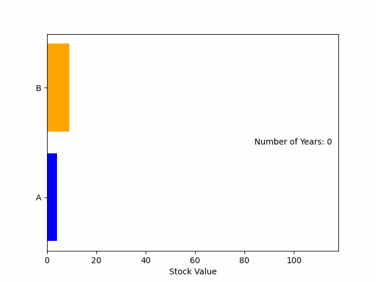
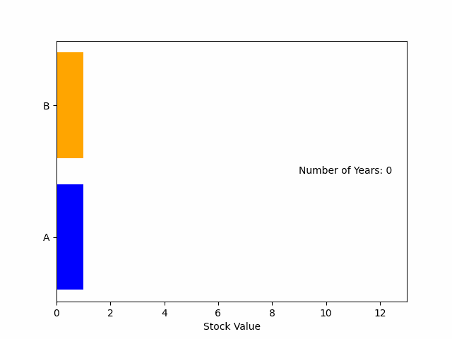

# Coding Assignment 1 (Stock Growth Prediction and Visualization)
## Problem Description:
Suppose you have two stock values, Stock A and Stock B.

Stock A and Stock B start at values 𝑎 and 𝑏 respectively. It's guaranteed that the initial value of Stock A is less than or equal to the initial value of Stock B.

Stock A grows rapidly and its value triples after every year, while Stock B's value doubles after every year.

After how many full years will the value of Stock A become strictly larger (higher) than the value of Stock B?

In addition to calculating the number of years, you are required to visualize the rising of the stocks each year using Matplotlib.

## Input:
The only line of the input contains two integers 𝑎 and 𝑏 (1 ≤ 𝑎 ≤ b ≤ 10) — the initial value of Stock A and the initial value of Stock B respectively.

## Output:
Print one integer, denoting the number of full years after which the value of Stock A will become strictly larger than the value of Stock B.

## Visualization:
Develop a function named plot_horizontal_bars that creates an animated horizontal bar plot for two bars named "A" and "B" representing `stock A` and `stock B`. The function should update the values of these bars over a specified number of iterations `n` which represents the number of years, and display the current year count count on the side of the plot as shown in the examples. Finally, The plotting stops when current year reaches the right value then saves the animation as a GIF file. 

Note: Each bar should be depicted with a different color line.

## Examples:
Input:\
```4 7```\
Output\
```2```

Visualization:\


Input:\
```4 9```\
Output\
```3```

Visualization:\


Input:\
```1 1```\
Output:\
```1```

Visualization:\


## Notes:
The provided example visualizations are for illustrative purposes. When implementing your solution, ensure to create similar plots based on the input values.

## Requirements:
```
pip install matplotlib
```

## Instructions
- Implement your solution in the `sol.py` file.
- Don't modify `main` function in the `sol.py` file.