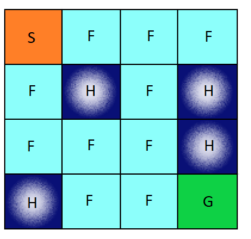

# Problem: Finding the Optimal Policy in a Markov Decision Process (MDP)

## Task:

As part of your mission, you will work on a fundamental problem in reinforcement learning: finding the optimal policy in a Markov Decision Process (MDP). This problem is crucial for understanding decision-making in uncertain environments, such as autonomous navigation and robotics.

## Background

An MDP is a mathematical framework for modeling decision-making in situations where outcomes are partly random and partly under the control of a decision-maker. An MDP is defined by:

- **States (`nS`)**: There are 16 states representing a 4x4 grid.
- **Actions (`nA`)**: Four actions are available in each state, corresponding to moving West, South, East, and North.
- **Transition Model (`P`)**: A dictionary where each state-action pair maps to a list of possible outcomes. Each outcome consists of:
  - Probability: The probability of transitioning to the next state.
  - Next State: The state reached after the action.
  - Reward: The immediate reward received after taking the action (for simplicity here it will be determined only by the next state).
- **Rewards (`R`)**: Immediate rewards for transitioning from one state to another.

The transition model `mdp.P` is a two-level dictionary where the first key is the state and the second key is the action. The 2D grid cells are associated with indices [0, 1, 2, ..., 15] from left to right and top to bottom, as in:
```
[[ 0  1  2  3]
 [ 4  5  6  7]
 [ 8  9 10 11]
 [12 13 14 15]]
```
Action indices [0, 1, 2, 3] correspond to West, South, East, and North. `mdp.P[state][action]` is a list of tuples (probability, next state, reward).

For example:
- `P[0][0] = [(0.25, 0, np.int64(0))]` (state 0 is the initial state)

For state 5, which corresponds to a hole in the ice, all actions lead to the same state with different rewards based on the value-table but they all return the same reward (so you need to figure out how to formulate the value table):

- `P[5][0] = [(0.25, 4, np.int64(0))]`
- `P[5][1] = [(0.25, 9, np.int64(0))]`
- `P[5][2] = [(0.25, 6, np.int64(0))]`
- `P[5][3] = [(0.25, 1, np.int64(0))]`

For state 6 there are actions that lead to some `bad state` and others lead to a normal state:

- `P[6][0] = [(0.25, 4, np.int64(-100))]`
- `P[6][1] = [(0.25, 9, np.int64(0))]`
- `P[6][2] = [(0.25, 6, np.int64(-100))]`
- `P[6][3] = [(0.25, 1, np.int64(0))]`

Here is an illustrative image of the Frozen Lake environment:


In this environment:
- `S` is the starting point.
- `F` represents frozen surface where you can safely walk.
- `H` represents holes, which are bad grids giving a negative reward. However, you can still move normally after falling into a hole.
- `G` is the goal.

You can start from any grid, even a hole, and the term 'hole' just indicates that it's a bad grid with a negative reward. Ending up in a hole means receiving a negative reward, but you can continue moving normally from there.

## Problem Statement

You are provided with a simulated environment representing a grid world (Frozen Lake) and an MDP defined by its transition probabilities and rewards. Your task is to implement the `OptimalPath` function to find the optimal policy that maximizes the expected reward. The goal is to use value iteration, a dynamic programming algorithm, to compute the optimal value function and the corresponding policy.

### Environment: Frozen Lake

#### Overview

The Frozen Lake environment is a classic problem in reinforcement learning where an agent must navigate a grid representing a frozen lake to reach a goal while avoiding holes. The grid is defined as follows:

- **Grid Size**: The environment is a (n x m) grid.
- **States**: Each cell in the grid represents a state, labeled from 0 to (n x m) in a row-major order (left to right, top to bottom).
- **Actions**: There are 4 possible actions the agent can take:
  - 0: West (left)
  - 1: South (down)
  - 2: East (right)
  - 3: North (up)

#### Reward Structure

In this environment, the rewards are defined to encourage the agent to reach the goal while avoiding holes:
- **Goal State**: Reaching the goal yields a reward of 100.
- **Hole States**: Falling into a hole yields a reward of -100.
- **Other States**: All other states yield a reward of 0.

#### Notes:
- Your initial position is undefined and you hve no prior knowledge about direction, your position and the position of the target
- You are required to return two arrays both of shape (n x m):
    1. The Expected value (The Expected reward to get under some policy).
    2. The policy I am following.
- Your code must converge after a sufficien number of iteration.
- **HINT**: the problem is greedy in the single iteration but it's dynamic through the iterations.
- We are interested only in the final value and are not discounting future rewards.

## Instructions
- Just implement the `step` funciton in the `step.py` file.

# Code Structure and Intstructions

This project implements a custom environment using OpenAI's Gymnasium and solves it using Markov Decision Processes (MDPs). The environment simulates a Frozen Lake where the goal is to retrieve a frisbee while avoiding holes in the ice starting from any grid.

## Installation

To get started, clone the repository and install the necessary dependencies.

### Prerequisites

- Python 3.8 or higher
- `pip` package manager

### Steps

1. **Create a virtual environment (in the *Coding_Assignment_02* Directory):**

    ```sh
    python -m venv venv
    ```

2. **Activate the virtual environment:**

    - On Windows:
        ```sh
        venv\Scripts\activate
        ```
    - On macOS and Linux:
        ```sh
        source venv/bin/activate
        ```

3. **Install the dependencies:**

    ```sh
    pip install -r requirements.txt
    ```
## **Required**:
- You can only edit the function `step` in `step.py` file.
- Complete your logic and submit your answer.

## Example Output

```plaintext
Iteration | max|V-Vprev| | # chg actions | V[0]
----------+--------------+---------------+---------
   0      | 25.00000      |  N/A          | 0.00000
   1      | 6.25000       |    3          | 0.00000
   2      | 1.56250       |    2          | 0.00000
```

- This output shows the progress of the value iteration algorithm in solving the MDP for the Frozen Lake environment.
- We will use this for testing.

## MDP class

### mdp: MDP
The MDP class is a representation of a Markov Decision Process (MDP). Here’s a breakdown of its components:
- *P*: A dictionary representing the state transition and reward probabilities. It is structured as a nested dictionary:
    - The first key is the state (an integer).
    - The second key is the action (an integer).
    - The value is a list of tuples, each representing a possible outcome of taking that action in that state:
        - Probability: The probability of this transition.
        - Nextstate: The resulting state after taking the action.
        - Reward: The reward received after taking the action.
- *nS*: The number of states in the MDP. For the Frozen Lake environment, this is 16.
- *nA*: The number of actions available in each state. For the Frozen Lake environment, this is 4 (representing West, South, East, North).

## Resources to understand the problem
- [MDP wiki](https://en.wikipedia.org/wiki/Markov_decision_process)
- [Frozen Lake as MDP](https://medium.com/swlh/frozen-lake-as-a-markov-decision-process-1692815ecfd1) (Note that our definition is slightly different from the definition you will read here *but it won't make any difference when you come to implement your solution* so relax and solve it as you understand it from previous resources.)